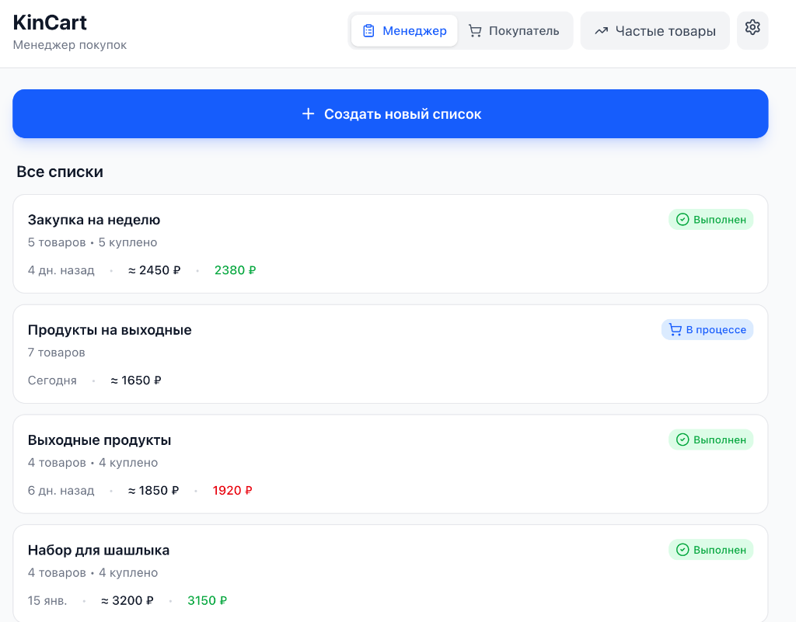
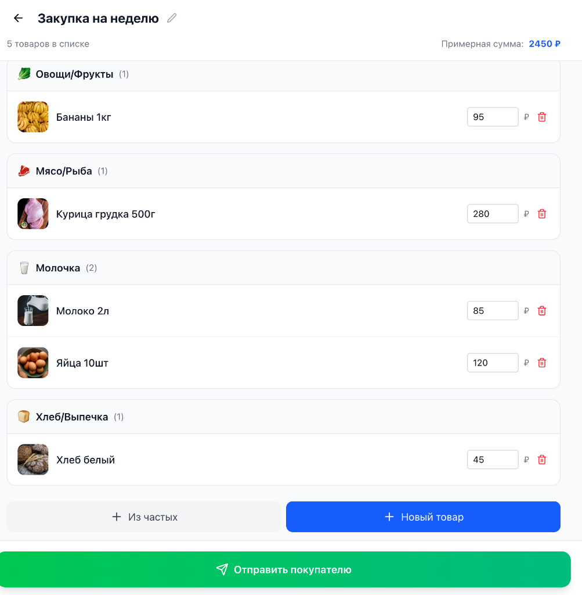
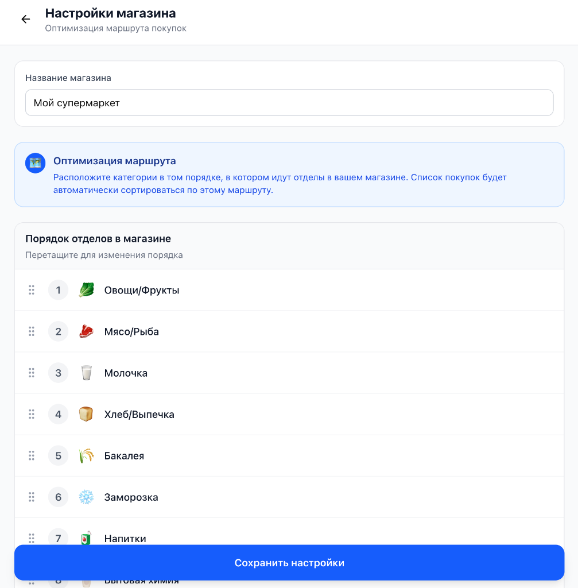
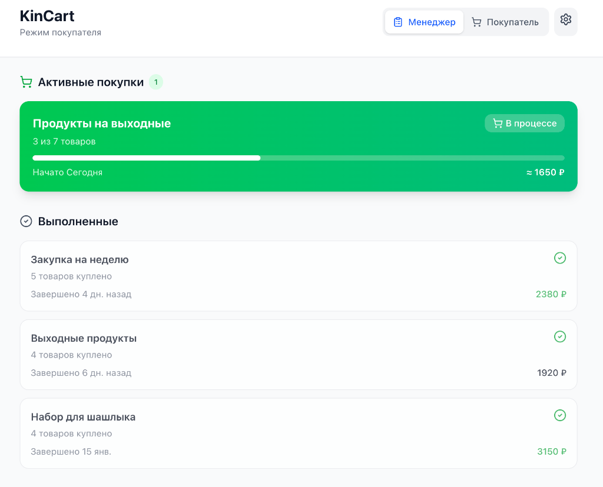
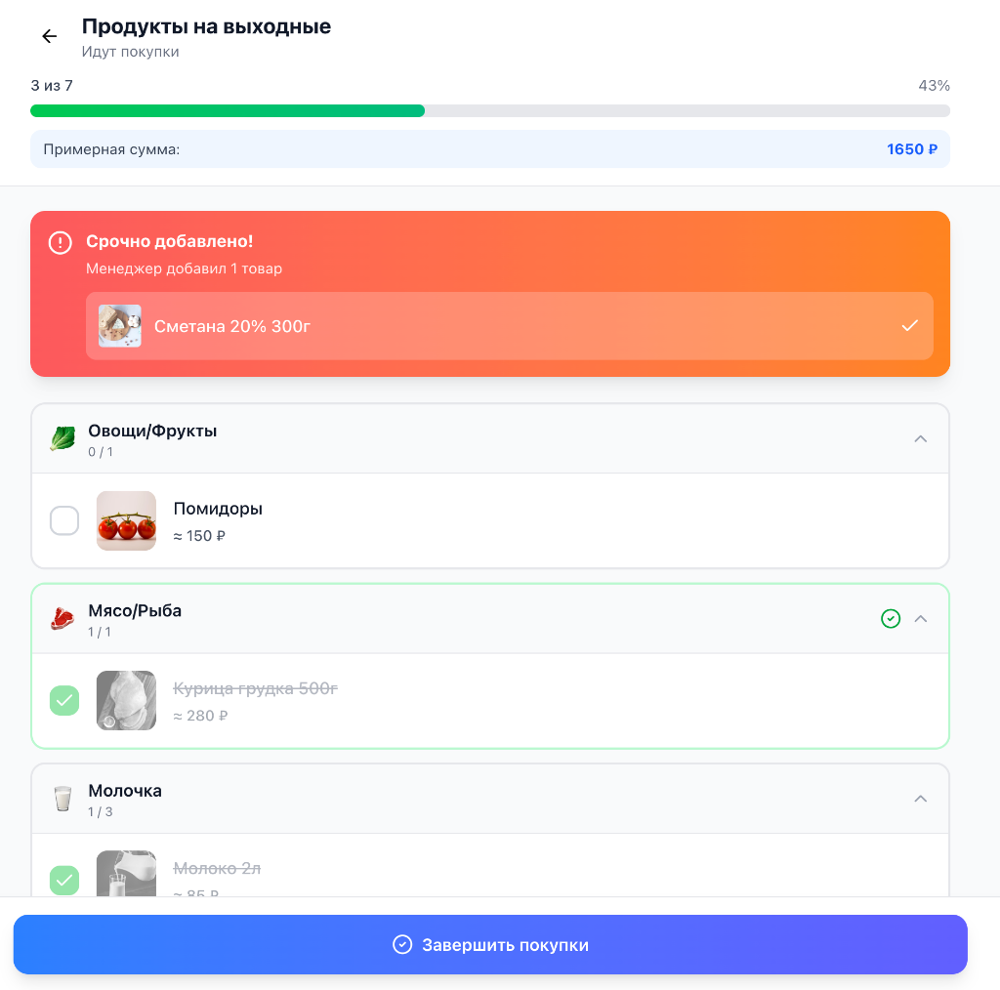

# KinCart 🛒

**KinCart** is your intelligent family shopping assistant. We connect users into **Families**, where data is synchronized between all members. Each user requires **individual access (login/password)**. The process is divided into two key roles: **Manager** (the one who plans and knows what’s needed at home) and **Shopper** (the one who is at the store and makes the purchases). 

The goal of the app is to minimize time in the store, eliminate endless messaging, and guarantee that you never buy the "wrong" milk.

---

## 👨‍💼 Role: Manager (Planning)

The Manager is responsible for creating lists, controlling the budget, and preparing the Shopper for the store visit.

### 1. List Management
On the main dashboard, the Manager sees all current and completed purchases. You can quickly create a new list or reuse an old one (e.g., "Weekly Groceries").


### 2. List Creation and Categorization
When filling a list, items are automatically distributed into departments. The Manager can specify estimated prices for budget planning.


### 3. Route Optimization
To prevent the Shopper from running from one end of the store to the other, the Manager can configure the department order once to match the layout of a specific supermarket.


---

## 🛒 Role: Shopper (In Store)

The Shopper receives a ready-made list, sorted by route, and can focus on the shopping process.

### 1. Active Shopping
On the main dashboard, the Shopper sees current tasks and progress.


### 2. Shopping Process and "Urgent Additions!"
Items are grouped by department in the order specified by the Manager. If the Manager remembers something important while the Shopper is already at the store, an "Urgent Addition!" notification appears at the very top of the list.


---

## ✨ Key Features

- **Intelligent Planning:** Add items from history in one click.
- **Family Access:** Secure login, shared lists, history, and settings for all family members.
- **Visual Cues:** Ability to attach photos of specific brands and detailed product descriptions.
- **Aisle Mapping:** Automatic list sorting based on the store route.
- **Real-time Updates:** Instant status updates upon page reload or navigation.
- **Budgeting:** Automatic calculation of the estimated purchase total.

---

## 🛠 Tech Stack

- **Backend:** Go (Golang) + Gin Framework
- **ORM/DB:** GORM + SQLite
- **Frontend:** React + Vite (Responsive Design)
- **Infrastructure:** Docker & Docker Compose

A detailed technical plan is available in [development_plan.md](development_plan.md).

---

## 🚀 Installation and Self-Hosting

KinCart is designed for easy deployment on your own server using Docker.

### 1. Requirements
- **Docker** and **Docker Compose**
- **Git** (for cloning the repository)

### 2. Quick Start
1. Clone the repository:
   ```bash
   git clone https://github.com/ya-breeze/KinCart.git
   cd KinCart
   ```

2. Start the containers:
   ```bash
   make docker-up
   ```
   *Or use `docker-compose up -d` directly.*

3. (Optional) Create test users for verification:
   ```bash
   make seed-test-data
   ```
   Passwords for `manager_test` and `shopper_test`: `pass1234`.

The app will be available at: `http://localhost` (or your server's IP).

---

## ⚙️ Configuration

### Environment Variables
You can configure the app using a `.env` file in the project root:

| Variable | Description | Example |
| :--- | :--- | :--- |
| `KINCART_DATA_PATH` | Path to the data folder | `/path/to/storage` |
| `JWT_SECRET` | JWT signing key (KEEP SECRET) | `your-secret-key` |
| `ALLOWED_ORIGINS` | Allowed domains for CORS (see below) | `https://kincart.example.com` |
| `KINCART_SEED_USERS` | Seed users/families at startup | `Smith:dad:pass1,Jones:mom:pass2` |

### CORS Configuration (Required for Production)

**CORS (Cross-Origin Resource Sharing)** controls which domains can access your KinCart backend. This is a critical security feature that prevents unauthorized websites from making requests to your server.

#### 🏠 Local Development
No configuration needed! The following origins are automatically allowed:
- `http://localhost:3000`, `http://localhost:5173`, `http://localhost:80`
- `http://127.0.0.1:3000`, `http://127.0.0.1:5173`, `http://127.0.0.1:80`

#### 🌐 Production Deployment

**You MUST set `ALLOWED_ORIGINS` when deploying to production.** This tells KinCart which domain(s) are allowed to access your backend.

##### Option 1: Cloudflare Tunnel (Recommended)

If you're using Cloudflare Tunnel to expose your app:

1. Set up your Cloudflare Tunnel (e.g., `kincart.yourdomain.com`)
2. Configure the environment variable:

```bash
# .env file
ALLOWED_ORIGINS=https://kincart.yourdomain.com
```

3. Restart the containers:
```bash
docker-compose down
docker-compose up -d
```

##### Option 2: Custom Domain with Reverse Proxy

If you're using Nginx, Traefik, or Caddy with your own domain:

```bash
# .env file
ALLOWED_ORIGINS=https://shopping.example.com
```

##### Option 3: Multiple Domains

If you have multiple domains (e.g., production + staging):

```bash
# .env file
ALLOWED_ORIGINS=https://kincart.example.com,https://staging.kincart.example.com
```

**Important Notes:**
- Always use `https://` for production domains (not `http://`)
- Include the full URL with protocol (e.g., `https://example.com`, not just `example.com`)
- Separate multiple domains with commas (no spaces)
- Do not include trailing slashes

#### 🔒 Security Impact

Setting `ALLOWED_ORIGINS` protects your KinCart instance from:
- **CSRF attacks** - Prevents malicious websites from making unauthorized requests
- **Data theft** - Blocks unauthorized domains from accessing your family's shopping data
- **Credential theft** - Ensures only your frontend can use authentication cookies

**Automatic User Creation:**
If `KINCART_SEED_USERS` is provided, the server will automatically create the specified families and users upon startup if they don't already exist. Format: `FamilyName:Username:Password`, separated by commas. Usage of this variable is recommended for development or initial setup only.

### Data Persistence
All important files are stored in the data directory:
- `kincart.db` — SQLite database.
- `uploads/` — Uploaded item images.
Regularly back up this directory.

---

## 👨‍👩‍👧‍👦 User Management

For regular use, create your own family and users.

### Using Makefile (Recommended)
**Create a family:**
```bash
make add-family NAME="TheSmiths"
```

**Add a user:**
```bash
make add-user FAMILY="TheSmiths" UNAME="john" PASS="mypassword"
```

### Directly via Docker
If you don't want to use `make`:
```bash
docker-compose exec backend ./kincart-admin add-user --family "TheSmiths" --username "john" --password "mypassword"
```

---

## 🛡️ Security and Production

For real-world use, follow this checklist:

### Essential Security Steps
1. **Set ALLOWED_ORIGINS:** Configure allowed domains for CORS (see [CORS Configuration](#cors-configuration-required-for-production) above)
2. **Change JWT_SECRET:** Use a strong, random secret key (minimum 32 characters)
3. **Use HTTPS:** Always use SSL certificates (e.g., Let's Encrypt via Cloudflare Tunnel, Caddy, or Certbot)
4. **Reverse Proxy:** Set up Nginx, Traefik, or Caddy in front of the application (or use Cloudflare Tunnel)

### Production Deployment Checklist
- [ ] Set `ALLOWED_ORIGINS` to your production domain(s)
- [ ] Change `JWT_SECRET` to a secure random value
- [ ] Enable HTTPS/SSL
- [ ] Configure reverse proxy or Cloudflare Tunnel
- [ ] Set up regular backups of the data directory
- [ ] Test CORS by accessing your app from the production domain
- [ ] Verify that unauthorized domains cannot access your API

### Troubleshooting CORS Issues

**Problem:** Frontend shows CORS errors in browser console

**Solutions:**
1. Check that `ALLOWED_ORIGINS` includes your exact domain with `https://`
2. Verify no trailing slash in the origin (use `https://example.com`, not `https://example.com/`)
3. Restart containers after changing environment variables: `docker-compose restart`
4. Check browser console for the exact origin being sent in requests
