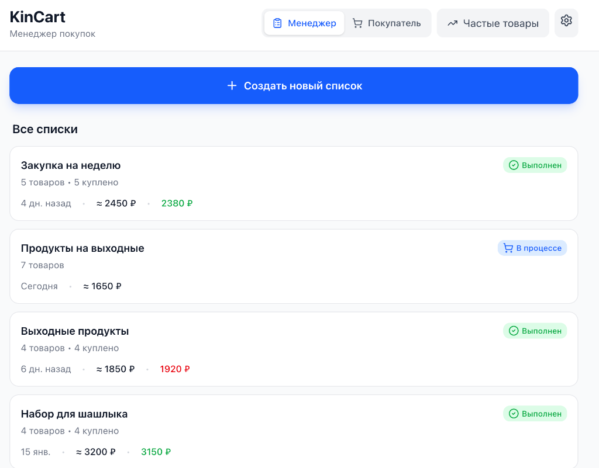
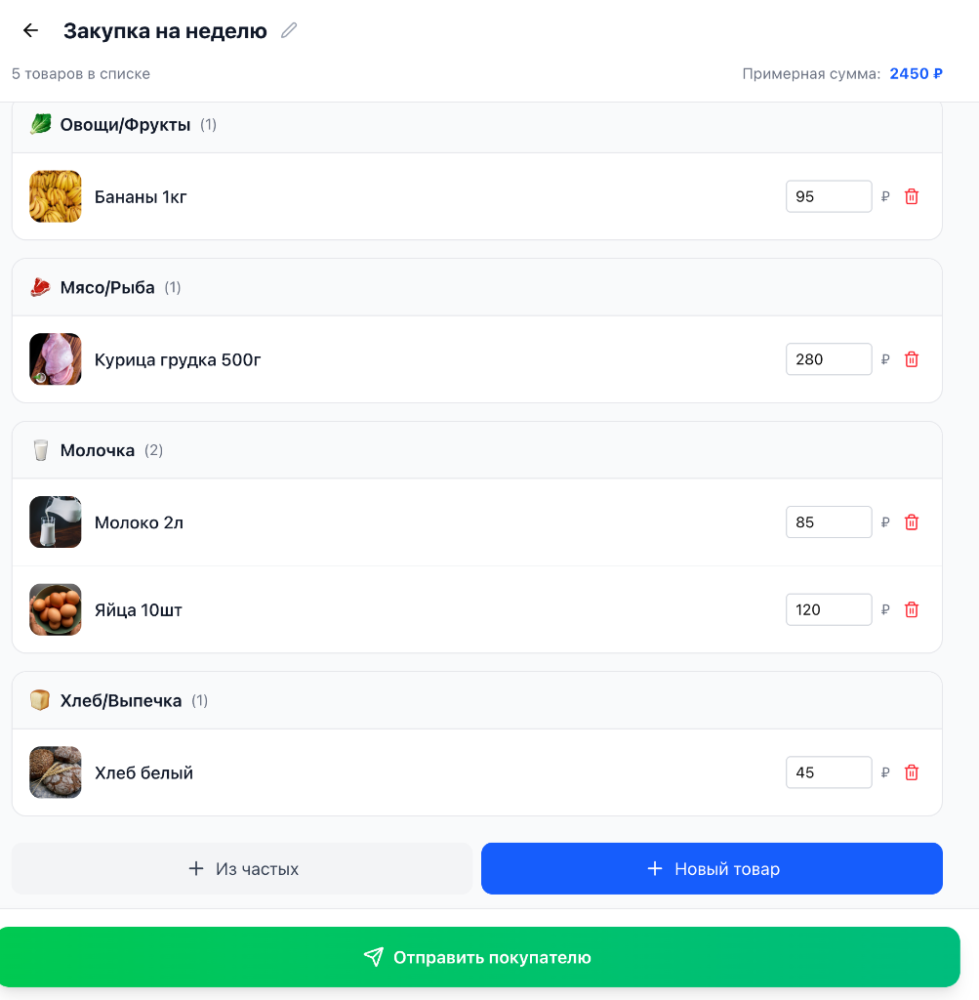
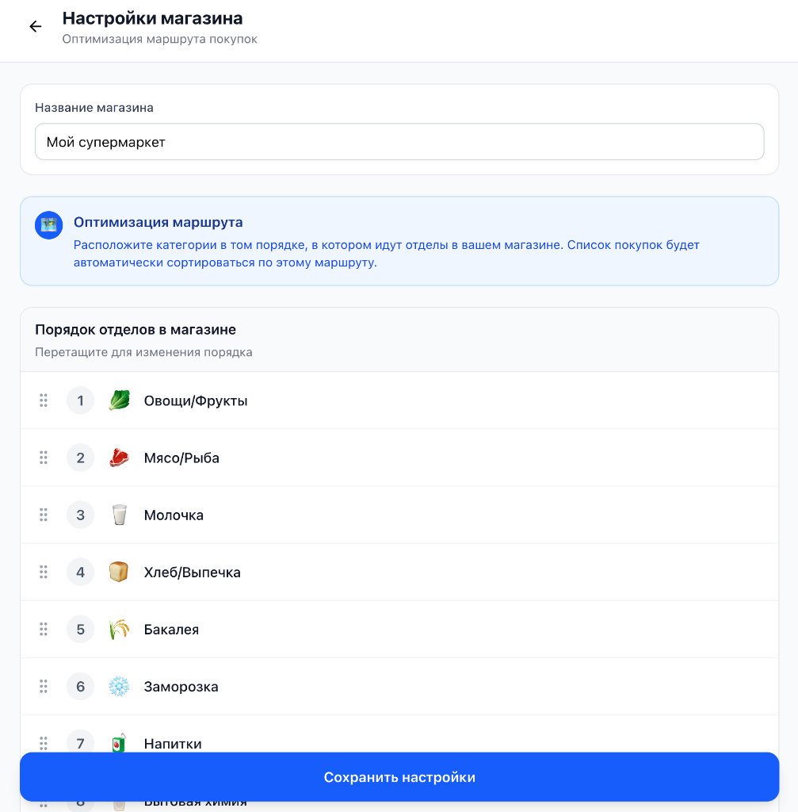
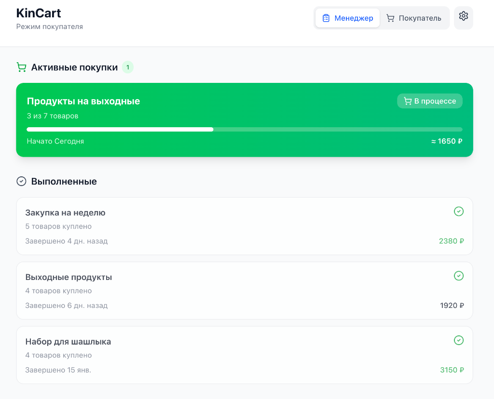
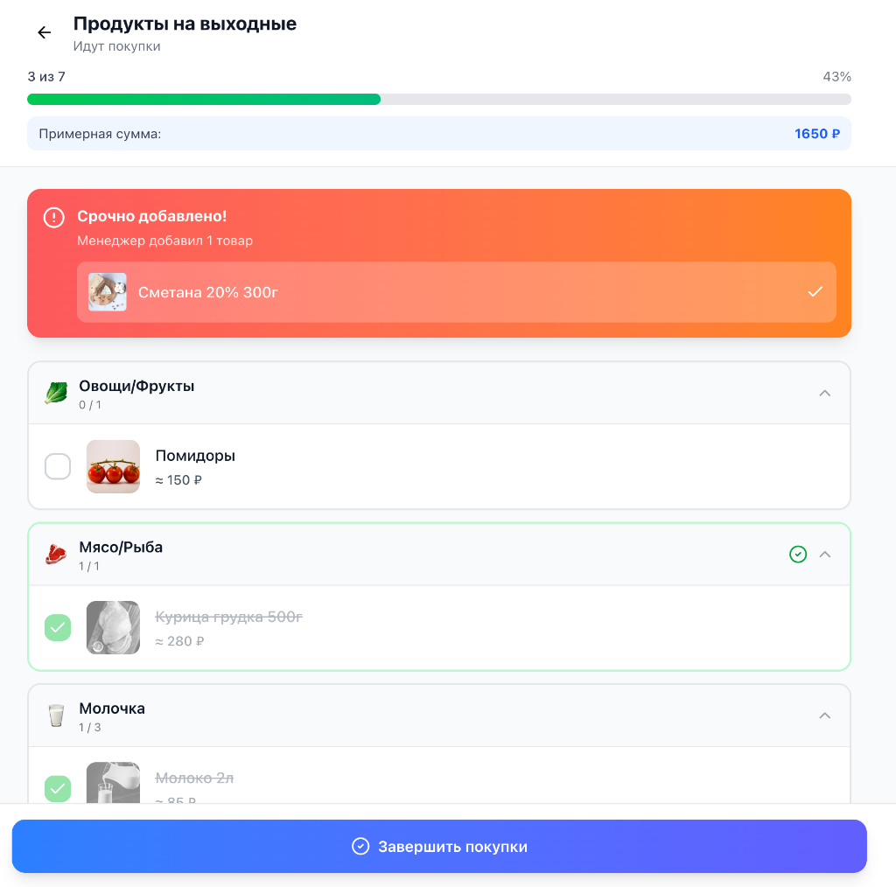

# KinCart 🛒

**KinCart** is your intelligent family shopping assistant. Users are connected into **Families**, where data is synchronized between all members. Each user has an individual login. The process is divided into two roles: **Manager** (plans and knows what's needed at home) and **Shopper** (at the store, making the purchases).

The goal is to minimize time in the store, eliminate endless messaging, and guarantee that you never buy the "wrong" milk.

---

## 👨‍💼 Role: Manager (Planning)

The Manager creates lists, controls the budget, and prepares the Shopper for the store visit.

### 1. List Management
On the main dashboard, the Manager sees all current and completed purchases. You can quickly create a new list or reuse an old one (e.g., "Weekly Groceries").


### 2. List Creation and Categorization
When filling a list, items are automatically distributed into departments. The Manager can specify estimated prices for budget planning.


### 3. Paste a Shopping List
Paste freeform text — the app parses it into structured items using AI. Handles Russian/multilingual input, quantity-first and name-first formats, and retail promo notation (e.g. `кефир 4+2` becomes two separate items). Parsed items are enriched with price hints from your purchase history before being added.

### 4. Route Optimization
To prevent the Shopper from running from one end of the store to the other, the Manager can configure the department order to match the layout of a specific supermarket.


---

## 🛒 Role: Shopper (In Store)

The Shopper receives a ready-made list, sorted by route, and can focus on the shopping process.

### 1. Active Shopping
On the main dashboard, the Shopper sees current tasks and progress.


### 2. Shopping Process and "Urgent Additions!"
Items are grouped by department in the order specified by the Manager. If the Manager remembers something important while the Shopper is already at the store, an "Urgent Addition!" notification appears at the very top of the list.


---

## ✨ Key Features

- **Intelligent Planning:** Add items from history in one click, with price hints from past purchases.
- **Paste-to-List:** Paste or type a freeform shopping list — AI parses it into structured items instantly.
- **Receipt Scanning:** Upload a photo of a receipt; AI matches purchased items against your list and tracks prices.
- **Store Flyers:** Browse discounted items from local store flyers with price history and trends.
- **Family Access:** Secure login, shared lists, history, and settings for all family members.
- **Visual Cues:** Attach photos of specific brands and detailed product descriptions to items.
- **Aisle Mapping:** Automatic list sorting based on the store route.
- **Real-time Updates:** Instant status updates upon page reload or navigation.
- **Budgeting:** Automatic calculation of the estimated purchase total.

---

## 🛠 Tech Stack

- **Backend:** Go (Golang) + Gin Framework
- **ORM/DB:** GORM + SQLite
- **Frontend:** React + Vite (Responsive Design)
- **Reverse Proxy:** Nginx
- **AI:** Google Gemini (receipt parsing, flyer parsing, paste-list parsing)
- **Infrastructure:** Docker & Docker Compose

---

## 🚀 Installation and Self-Hosting

KinCart is designed for easy deployment on your own server using Docker.

### 1. Requirements
- **Docker** and **Docker Compose**
- **Git** (for cloning the repository)

### 2. Quick Start
1. Clone the repository:
   ```bash
   git clone https://github.com/ya-breeze/KinCart.git
   cd KinCart
   ```

2. Start the containers:
   ```bash
   make docker-up
   ```
   *Or use `docker compose up -d` directly.*

3. (Optional) Create test users for verification:
   ```bash
   make seed-test-data
   ```
   Passwords for `manager_test` and `shopper_test`: `pass1234`.

The app will be available at: `http://localhost` (or your server's IP).

---

## ⚙️ Configuration

### Environment Variables
Configure the app using a `.env` file in the project root:

| Variable | Description | Default |
| :--- | :--- | :--- |
| `JWT_SECRET` | JWT signing key — **change in production** | `kincart-super-secret-key` |
| `ALLOWED_ORIGINS` | Comma-separated CORS origins | *(localhost origins allowed)* |
| `KINCART_DATA_PATH` | Root data directory | `./kincart-data` |
| `DB_PATH` | SQLite database path | `./data/kincart.db` |
| `UPLOADS_PATH` | Uploaded files directory | `./uploads` |
| `FLYER_ITEMS_PATH` | Parsed flyer item images directory | `./uploads/flyer_items` |
| `KINCART_SEED_USERS` | Auto-create users on startup | — |
| `GEMINI_API_KEY` | Google Gemini API key — required for AI features | — |
| `ENABLE_FLYER_SCHEDULER` | Set to `false` to disable background flyer download & parsing | `true` |
| `ENABLE_RECEIPT_SCHEDULER` | Set to `false` to disable background receipt processing | `true` |
| `NGINX_HTTP_PORT` | Nginx HTTP port | `80` |
| `NGINX_HTTPS_PORT` | Nginx HTTPS port | `443` |

**AI features** (receipt scanning, paste-list parsing, flyer parsing) require `GEMINI_API_KEY`. The app works without it — AI features are gracefully disabled.

**`KINCART_SEED_USERS`** auto-creates families and users on startup if they don't exist. Format: `FamilyName:Username:Password`, comma-separated. Recommended for development or initial setup only.

### CORS Configuration (Required for Production)

**CORS** controls which domains can access your KinCart backend, preventing unauthorized sites from making requests to your server.

#### 🏠 Local Development
No configuration needed. The following origins are automatically allowed:
- `http://localhost:3000`, `http://localhost:5173`, `http://localhost:80`
- `http://127.0.0.1:3000`, `http://127.0.0.1:5173`, `http://127.0.0.1:80`

#### 🌐 Production Deployment

**You MUST set `ALLOWED_ORIGINS` when deploying to production.**

```bash
# .env file — single domain
ALLOWED_ORIGINS=https://kincart.yourdomain.com

# .env file — multiple domains (no spaces)
ALLOWED_ORIGINS=https://kincart.example.com,https://staging.kincart.example.com
```

Rules:
- Always use `https://` for production domains
- Include the full URL with protocol — not just the hostname
- Separate multiple domains with commas, no spaces
- No trailing slashes

### Data Persistence
All important files are stored in the data directory:
- `kincart.db` — SQLite database
- `uploads/` — Uploaded item and receipt images
- `flyer_items/` — Parsed flyer item images

Back up this directory regularly.

---

## 👨‍👩‍👧‍👦 User Management

### Using Makefile (Recommended)
```bash
# Create a family
make add-family NAME="TheSmiths"

# Add a user to a family
make add-user FAMILY="TheSmiths" UNAME="john" PASS="mypassword"
```

### Directly via Docker
```bash
docker compose exec backend ./kincart-admin add-user --family "TheSmiths" --username "john" --password "mypassword"
```

---

## 🛡️ Security and Production

### Production Checklist
- [ ] Set `ALLOWED_ORIGINS` to your production domain(s)
- [ ] Set `JWT_SECRET` to a strong random value (minimum 32 characters)
- [ ] Enable HTTPS/SSL (via Cloudflare Tunnel, Caddy, or Certbot)
- [ ] Configure a reverse proxy or Cloudflare Tunnel in front of the app
- [ ] Set up regular backups of the data directory
- [ ] Test CORS by accessing the app from the production domain

### Troubleshooting CORS Issues

**Problem:** Frontend shows CORS errors in the browser console

**Solutions:**
1. Check that `ALLOWED_ORIGINS` includes your exact domain with `https://`
2. Verify no trailing slash (`https://example.com`, not `https://example.com/`)
3. Restart containers after changing environment variables: `docker compose restart`
4. Check the browser console for the exact origin being sent in requests
